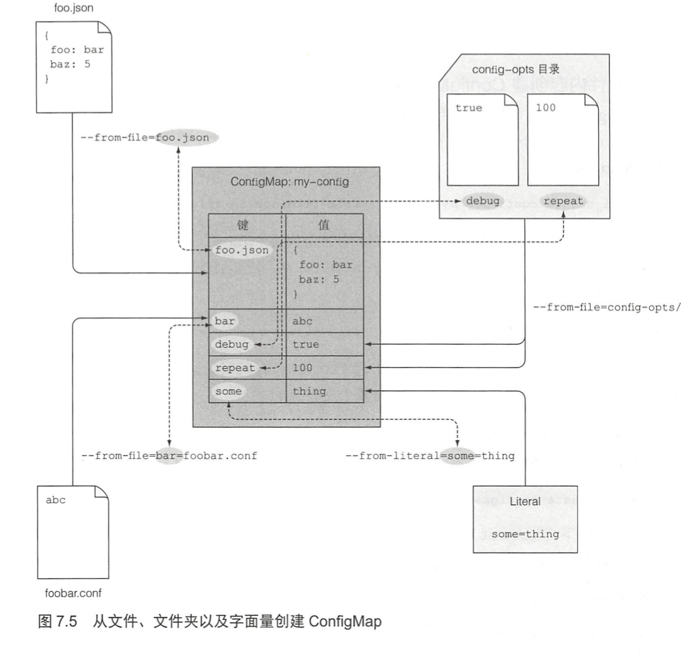
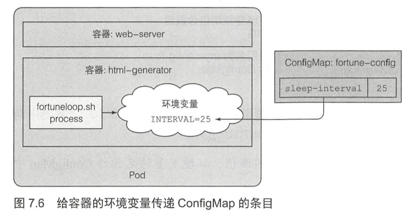
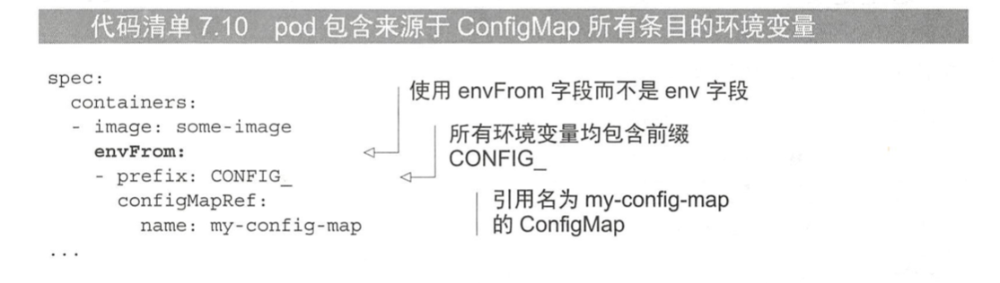
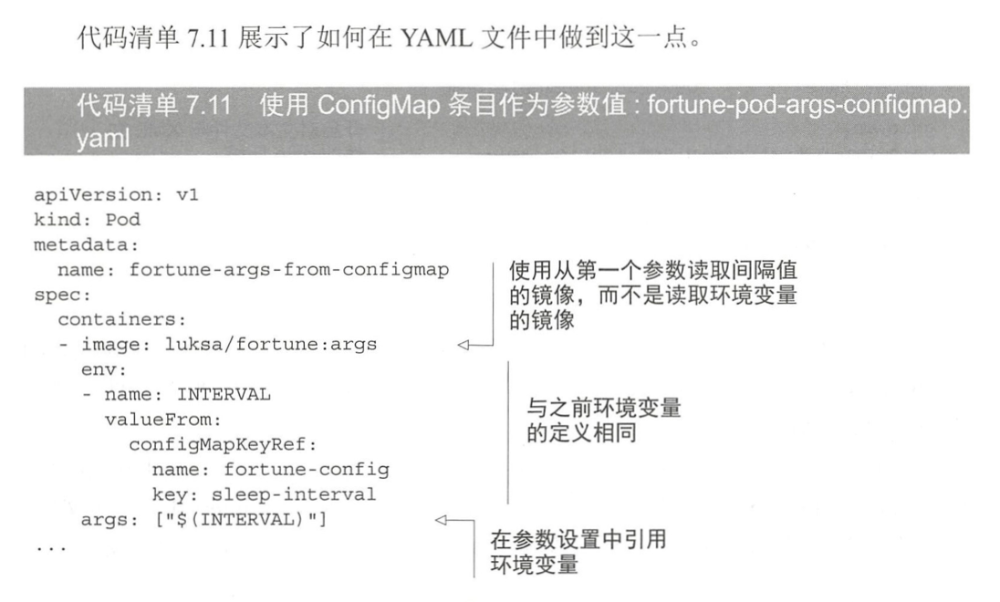

[TOC]

### k8s的配置

------

在构造容器的时候，都需要一些配置选项，如果只是简单的把配置信息写入Dockerfile文件中，后期就会变得难以维护。

向docker容器注入变量的几种方式

- 通过向容器传递命令行参数

  ```yaml
  Kind: Pod
  spec: 
  	containers:
  		- image: some/image
  			command: ["/bin/command"]
  			args: ["arg1", "arg2", "arg3"]
  ```

- 为容器设置环境变量

  ```yaml
  Kind: Pod
  spec: 
  	containers:
  		- image: some/image
  			env: 
  				- name: INTERVAL  # 采用name-value的方式进行定义
  					value: "30"
  ```

- 通过特殊类型的卷将配置文件挂在到容器中

  ```yaml
  Kind: Pod
  spec: 
  	containers:
  		- image: nginx:alpine
  			name: web-server
   			volumeMounts:
   			 ...
  				- name: config
  				  mountPath: /etc/nginx/conf.d
            readOnly: true
  			 ...
    volume: 
  		- name: config
  			configMap:
  				 name: fortune-config
  ...
  ```

#### 通过configMap来解耦

##### 介绍

ConfigMap是k8s集群中一个单独的资源，用来存储键值对形式的配置信息。通过将业务代码和配置信息隔离开来，可以减少容器的复杂度，同时让容器能动态部署到不同环境（开发，测试，生产），以及在不影响容器运行下进行配置的热更新。

工作原理

- 首先，准备多个不同环境的configMap，例如dev，tests，product
- 将对应的configMap加入到对应环境的k8s的集群中
- 最后，pod容器根据configMap的来检索相关的配置内容

##### 创建configMap

- 通过字面量来创建

  ```shell
  # --from-literal 表示一个key-value键值对，可以通过多个 --from-literal 来声明多个键值对
  
  kubectl create configmap fortune-config --from-literal=sleep-interval=25 --from-literal=a=1
  
  # 查看已生成的cm的信息
  kubectl get cm fortune-config -o yaml
  ```

- 通过文件内容来创建

  ```bash
  # 其中`--from-file`的上下文是当前目录，可以通过文件，文件夹等方式进行配置录入
  
  # 直接引用文件，则生成key为foo.json,值为文件内容的键值对
  kubectl create configmap myfile-configmap --from-file=foo.json
  
  # 手动指定键的名称
  kubectl create configmap myfile-configmap-key --from-file=bar=foobar.conf
  
  # 从文件夹导入所有文件
  kubectl create configmap myfile-configmap-dir --from-file=config-ops/
  
  # 从env文件导入配置
  kubectl create configmap myfile-configmap-env --from-env-file=.env
  ```

- 混合创建

  ```yaml
  kubectl create configmap fortune-config  \
  --from-literal=some=thing  \
  --from-file=foo.json  \
  --from-file=bar=foobar.conf  \
  --from-file=config-ops/
  
  # 查看已生成的cm的信息
  kubectl get cm fortune-config -o yaml
  
  apiVersion: v1
  data: # 存储的内容信息
    bar: abc
    debug: "true"
    foo.json: |-
      {
          "foo": "bar",
          "baz": 5
      }
    repeat: "100"
    some: thing
  kind: ConfigMap
  metadata: #configmap的属性
    creationTimestamp: "2022-09-07T15:13:12Z"
    name: fortune-config
    namespace: default
    resourceVersion: "22621748"
    uid: 8a39edf1-7a6d-4d3e-9cfb-3ffca2880297
  ```

  

​	

##### 将configMap注入到pod

- 通过环境变量的方式注入

  	

​			

- 一次性注入configMap

  

​			通过configMapRef可以批量赋值环境变量，还可以通过perfix设置前缀，例如configMap中的FOO，变换			成CONFIG_FOO。当存在FOO-BAR这种破折号的的变量，则被忽略


-  使用configMap条目 作为 命令参数

- 通过configMap卷将条目暴露为文件

  - 更改配置文件，开启gzip压缩

    ```
    server {
        listen              80;
        server_name         www.kubia-example.com;
    
        gzip on;  # 开启对文本文件对xml文件的gzip压缩，观察是否更新配置
        gzip_types text/plain application/xml;
    
        location / {
            root   /usr/share/nginx/html;
            index  index.html index.htm;
        }
    }
    ```

    

  - 读取文件生成configMap

    ```
    kubectl create configmap fortune-config --from-file=configmap-files
    ```

    

  - 创建pod引用configMap

    ```yaml
    apiVersion: v1
    kind: Pod
    metadata:
      name: fortune-configmap-volume
    spec:
      containers:
     	···
      - image: nginx:alpine
        name: web-server
        volumeMounts:
        ···
        - name: config   # 使用下面定义的config名称的卷
          mountPath: /etc/nginx/conf.d  # 挂在configmap卷到这个位置
          readOnly: true  # 设置权限
        ···
      volumes:
      ···
      - name: config   # 卷定义引用configmap
        configMap:
          name: fortune-config
      ···
    ```

  - 访问nginx服务，检查gzip是否开启

    ```
    # 暴露pod的端口
    kubectl port-forward fortune-configmap-volume 8088:80 &
    
    # 访问服务
    curl -H  "Accept-Encoding: gzip" -I localhost:8088
    ```

  - 访问容器目录，检查目录是否包含configmap的配置文件
	  ```bash
	  kubectl exec -it fortune-configmap-volume -c web-server -- sh
	  
    ls /etc/nginx/conf.d/  
    my-nginx-config.conf sleep-interval 
    ```
  
  - 通过卷的items属性指定条目挂载
  
    ```yaml
    # fortune-configmap-volume-with-items.yaml
    ···
    volumes:
    	- name: config
    		configMap: 
    				name: fortune-config
    				items:    #只显示配置的条目
    					key: my-nginx-config.conf
    					path: gzip.conf
    ```
  
    ```bash
    # 进入pod检查是否生效
    kubectl exec -it fortune-configmap-volume-with-items -c web-server -- sh
    
    ls /etc/nginx/conf.d/  # 将会只看到gzip.conf文件
    ```

####		 	 使用secret给容器传递敏感数据

##### 介绍secret

secrets用于存储和管理一些敏感数据，比如密码，token，[密钥](https://so.csdn.net/so/search?q=密钥&spm=1001.2101.3001.7020)等敏感信息。它把 Pod 想要访问的加密数据存放到 Etcd 中。然后用户就可以通过在 Pod 的容器里挂载 Volume 的方式或者环境变量的方式访问到这些 Secret 里保存的信息了。

##### 创建secret

```bash
# 使用命令行创建secret
kubectl create secret generic mysecret --from-literal=username=admin --from-literal=password=123456
```

```bash
# 将字符串进行base64加密
echo -n 'admin' | base64

# 使用yaml创建secret
apiVersion: v1
kind: Secret
metadata:
  name: mysecret
type: Opaque 
data:
  password: MTIzNDU2 # 使用data，无法自动加密，需要手动加密
stringData:
  username: admin  # 使用stringData， 会自动转成base64编码

kubectl apply -f mysecret.yaml
```

```bash
# 使用--from-file创建

kubectl create secret generic secret-file --from-file=secret-files
```


##### 在pod中使用secret

- 在pod中以文件形式使用secret

```yaml
# secret-pod-volume.yaml

apiVersion: v1
kind: Pod
metadata:
  name: secret-pod-volume
spec:
  containers:
  - name: mypod
    image: busybox
    volumeMounts:
    - name: foo
      mountPath: "/etc/foo"
      readOnly: true
  volumes:
  - name: foo
    secret:
      secretName: mysecret
      optional: false # 默认设置，意味着 "mysecret" 必须已经存在
```

```bash
kubectl exec -it secret-pod-volume -- sh
cat /etc/foo/username
cat /etc/foo/password
```


- 以环境变量的方式使用secret

```yaml
# secret-pod-env.yaml

apiVersion: v1
kind: Pod
metadata:
  name: secret-pod-env
spec:
  containers:
  - name: mycontainer
    image: redis
    env:
      - name: SECRET_USERNAME
        valueFrom:
          secretKeyRef:
            name: mysecret
            key: username
            optional: false # 此值为默认值；意味着 "mysecret"
                            # 必须存在且包含名为 "username" 的主键
      - name: SECRET_PASSWORD
        valueFrom:
          secretKeyRef:
            name: mysecret
            key: password
            optional: false # 此值为默认值；意味着 "mysecret"
                            # 必须存在且包含名为 "password" 的主键
  restartPolicy: Never
```

```bash
kubectl exec -it secret-pod-env -- sh
echo $SECRET_USERNAME
echo $SECRET_PASSWORD
```

- 为服务账号添加imagePullSecrets

```bash
# 创建docker镜像拉取凭证 secret

kubectl create secret docker-registry myregistrykey  \
--docker-server=DUMMY_SERVER \
--docker-username=DUMMY_USERNAME \
--docker-password=DUMMY_DOCKER_PASSWORD \
--docker-email=DUMMY_DOCKER_EMAIL
```

```bash
# 为serveraccount设置imagePullSecrets

kubectl patch serviceaccount default -p '{"imagePullSecrets": [{"name": "myregistrykey"}]}'
```
